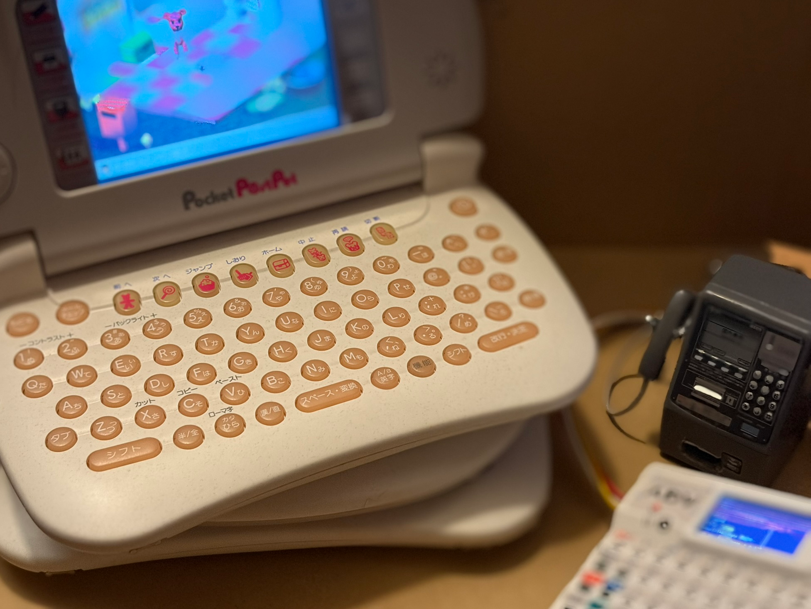

# CCCP
## Cardputer Communication Connector for PocketPostPet

**また会える！**

CCCPはPocketPostPet をインターネットに繋げる小さなプログラムです。
街のどこにでもあった赤外線対応公衆電話のエミュレータです。

お友達のいない人にも安心のLLMによる自動お返事機能も付けましたw

> **Note for English readers:**  
> This project is only useful if you own a PocketPostPet.  
> Setup information is mainly provided in Japanese.




---

## できること

- PocketPostPet をインターネットにつなげる (赤外線通信)
- PocketPostPet でペットメールを送る/受け取る
- LLMをつかった自動応答のお返事を受け取る
- 相手の名前・間柄・ペット名・ペットの種類を登録する
- CCCPを2台用意して、PocketPostPet同士でメールをやり取りする

---

## 必要なもの

- **M5Stack Cardputer ADV**
- **赤外線ユニット (MY018 : AliExpressで4千円くらい)**
- **赤外線対応公衆電話のミニチュア**
- **[Grove to Duponケーブル](https://docs.m5stack.com/ja/accessory/cable/Grove_to_Dupont)
- microSDカード
- PocketPostPet本体
- MMC 16M(Windows CE化に必要)

### 全体イメージ

### 赤外線ユニット設定変更

赤外線ユニットは、9600bps対応となるようにはんだ付けをしてください。
MY018の場合はC0B0A0が結線となるようにしてください。

> 電源・GNDの向き、TX/RXの接続をよく確認してください。  
> 通信できない場合は、まず配線とはんだ箇所を確認してください。

---

## 1. PocketPostPet を Windows CE 化する

CCCPを使用するには、**PocketPostPetのWindows CE化が必須**です。
Windows CE化については、以下のページを参考にしてください。
[POCKET POSTPET / Windows CE化 - ポストペット省](https://www.postpet.info/tool/pocket/index.html)
Windows CE化が完了したら、PocketPostPet上で **irSwitch** を使用して、  
接続先を **「赤外線対応公衆電話」** に変更してください。
CCCPは、この赤外線接続設定で使用します。

---

## 2. CCCP を M5Burner で書き込む

CCCPは **M5Burner** から書き込めます。
M5BurnerはM5Stack公式のファームウェア書き込みツールです。
[M5Burner - M5Stack公式](https://docs.m5stack.com/ja/uiflow/m5burner/intro)
M5Burnerの **Share Burn** を開き、次のShare Codeを入力してください。

```text
WlZ2CplU1PTtneaz
```

Cardputer ADVへ書き込んだら起動してください。

---

## 3. Cardputer と赤外線ユニットを接続する

Cardputer と赤外線ユニットは Grove to Duponケーブルで接続します。
赤外線ユニットに印刷された以下の表記を確認して接続してください。
- VCC
- GND
- TX
- RX

**TXとRXはクロス接続**します。通信できなかったらTXとRXを入れ替えてみてください。
公衆電話のミニチュアに組み込む場合も、まずは机の上で通信できることを確認してから組み立てるのがおすすめです。

---

## 4. Wi-Fi を設定する

Cardputerの画面で、

```text
設定
  └ Wi-Fi
```

を開いてSSIDとパスワードを設定してください。
保存済みWi-Fi情報を消したい場合は、Wi-Fi設定画面から削除できます。

---

## 5. LLM を設定する

```text
設定
  └ LLM
```

からLLMの接続先を設定できます。

初期状態ではCCCPのデフォルト設定を使用できます。

将来的には、OpenAI互換APIなども設定できるようにしています。

設定項目の例:

- Provider
- Model
- API Key
- Endpoint

> APIキーは秘密情報です。  
> microSDカードや設定ファイルを他人に渡す場合は、APIキーが残っていないことを確認してください。

---

## CCCPを2台使う

CCCPは、LLMとの自動応答だけに使うものではありません。

CCCPを2台用意すれば、それぞれのPocketPostPetからメールを送り、  
**PocketPostPet同士でメールをやり取りする**こともできます。

友達や家族がPocketPostPetを持っている場合は、CCCPをそれぞれ用意して遊ぶことができます。

---

## 外部のメールアドレスへ送る

通常はCCCP内の `@test.test` / `@llm.test` を使って遊べます。
さらにMXを設定すれば、CCCPから通常のインターネットメールアドレスへメールを送ることもできます。
これは少し上級者向けの設定です。  
まずは `@test.test` と `@llm.test` だけで動作を確認してから試すのがおすすめです。

> 外部メールを利用する場合は、利用しているネットワークやメールサービス側の制限、迷惑メール対策などによって配送できない場合があります。

---

## 6. メールアドレスについて

CCCPでは、PocketPostPetとのやり取り専用のテスト用ドメインを使用します。

### `@test.test`

PocketPostPet側、自分側のメールアドレスとして使います。

例:

```text
test@test.test
```

`@`より前は好きな名前にできます。

例:

```text
taro@test.test
postpet@test.test
```

### `@llm.test`

CCCP側の相手のメールアドレスとして使います。

例:

```text
momo@llm.test
```

こちらも`@`より前は好きな名前にできます。

例えば、

```text
自分:
taro@test.test

相手:
momo@llm.test
```

のように使います。

`test.test` と `llm.test` はCCCP内で使うためのテスト用ドメインです。  
通常のインターネットメールへ送信するためのものではありません。

---

## 7. 最初のメールを送る

新しい `@llm.test` の宛先へ初めてメールを送るときは、  
本文を**4行だけ**にしてください。

```text
名前
間柄
ペットの名前
ペットの種類
```

例:

```text
ももち
彼女
かめこ
KAME
```

### 1行目: 名前

CCCP側の相手の名前です。

例:

```text
ももち
```

### 2行目: 間柄

次のどれか1語を書いてください。

```text
パパ
ママ
彼氏
彼女
友達
殿様
```

### 3行目: ペットの名前

例:

```text
かめこ
```

### 4行目: ペットの種類

次のどれかを書いてください。

```text
BEAR
CAT
DOGY
HAM
KAME
MECA
PENG
RABI
```

亀なら、

```text
KAME
```

です。

登録が完了すると、以後は普通の文章でメールできます。

---

## 初回メールの書き方を忘れたら

Cardputerのホーム画面で **Hキー** を押すと、初回メールの書き方を確認できます。

---

## 登録できなかった場合

初回メールの形式を認識できなかった場合は、CCCPから登録できなかったことを知らせるメールが返ります。
その場合は、4行の形式を確認してもう一度送ってください。

---

## 普段の使い方

初回登録が終わった後は、普通の文章でメールを送ってください。
CCCPが内容を読み、相手との間柄やこれまでのやり取りを参考にして返事を作ります。
件名も、そのメールに合うものが自動で付けられます。

---

## ひみつにっき

対応するメールでは、PocketPostPetのひみつにっきも楽しめます。
内容は固定文ではなく、そのときのやり取りに合わせて作られます。

---

## 注意

- CCCPを使うにはPocketPostPetのWindows CE化が必要です
- irSwitchで接続先を「赤外線対応公衆電話」にしてください
- 自動応答を利用するとLLMサービスでメールを解析します、知られて困る内容は書かないでください
- APIキーは各自で安全に管理してください

---

## License

TBD
